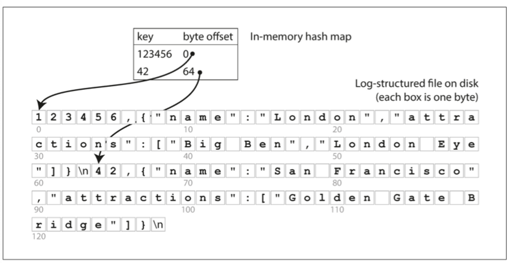
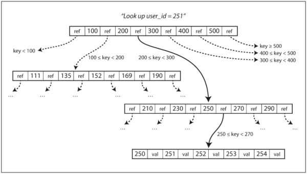
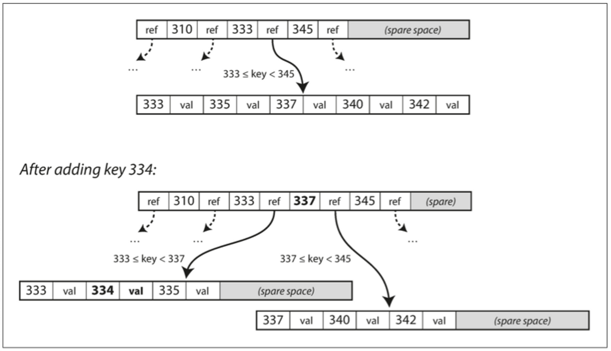

# 저장소와 검색
## 데이터베이스를 강력하게 만드는 데이터 구조
* 전체 데이터베이스 파일을 처음부터 끝까지 스캔해야한다면? 검색 비용은 O(n)
* **색인**
  * 특정 키의 값을 효율적으로 찾기 위한 데이터 구조
  * 부가적인 메타데이터를 유지해서 원하는 데이터 위치를 찾는데 도움
    * primary data가 아님, **추가적인 구조**
  * db는 색인의 추가와 삭제 허용
  * 데이터 베이스의 내용에는 영향을 미치지 않고, 질의의 성능에만 영향
    * 어떤 종류의 색인이라도 쓰기 속도를 느리게 만듦
    * 쓰기 과정에서 오버헤드 발생 
      * 색인도 갱신해야하기 때문,,, 
  * 개발자가 애플리케이션의 전형적인 질의 패턴에 대한 지식을 활용해 수동으로 색인을 **선택**
    * 필요 이상으로 오버헤드를 발생시키지 않으면서, 애플리케이션에 가장 큰 이익을 안겨주는 색인 선택 가능
### 해시 색인
* key-value (like dictionary type)
  * hash map, hash table
* key를 데이터 파일의 바이트 오프셋에 mapping
  
  * 파일에 새로운 key-value를 추가할 때마다 방금 기록한 데이터의 오프셋을 반영하기 위해 해시맵 갱신
* 비트캐스크에서 사용
  * 해시 맵을 전부 메모리에 유지 
    → 사용 가능한 RAM에 모든 키가 저장된다는 조건을 전재로 고성능 읽기, 쓰기 보장
  * 한 번의 디스크 탐색으로 값을 디스크에 적재 가능
    * 사용 가능한 메모리보다 더 많은 공간을 사용 가능
    * 이미 데이터 파일의 일부가 캐시에 있다면 디스크 입출력이 필요하지 않음
* 각 키의 **값이 자주 갱신되는 상황**에 매우 적합
  * 쓰기가 아주 많지만 고유 키는 많지 않음
  * 메모리에 모든 키를 보관 가능
* append only의 경우 디스크 공간 부족으로 이어짐
  * 특정 세그먼트로 로그를 나누어 저장
* compaction
  * 로그에서 중복된 키를 버리고 각 키의 최신 갱신 값만 유지
  * 세그먼트를 더 작게 만들기 때문에, 수행 시 여러 세그먼트들의 병합 또한 가능
  * append only이므로 병합할 세그먼트는 새로운 파일로 생성
  * 세그먼트의 병합은 백그라운드 스레드에서 수행하고, 그동안의 읽기와 쓰기는 이전 세그먼트 파일을 이용해 수행
  * 작업 완료 후 읽기 요청은 새로운 세그먼트를 사용하게끔 전환
#### 실제 구현시 고려해야할 사항
* 파일 형식, 레코드 삭제, Crash Recovery, Partial writing, 동시성 제어
#### 장점
* 추가와 세그먼트 병합은 순차적인 쓰기 과정 → 무작위 쓰기보다 훨씬 빠름
* 동시성과 고장 복구는 간단하게 수행 가능 (append only이기 때문에..)
* 오래된 세그먼트 병합은 조각화되는 데이터 파일 문제를 피할 수 있음
#### 단점
* 메모리에 키를 저장하므로 너무 많으면 메모리 이슈
* 원칙적으로는 디스크 내에 해시 맵을 유지할 수 있으나.. 성능 문제가 있음
  * 무작위 접근 I/O가 많이 필요하고, 디스크가 풀찼을 경우는 확장 비용이 비쌈
* range query에는 효율적이지 않음
  * 해시맵에서 각각 모든 개별 키를 조회해야하기 때문에..

---

## SS테이블과 LSM트리
* key-value를 Key 순서로 정렬
* SS테이블 (a.k.a. Sorted String Table)
  * 각 키는 병합된 세그먼트 파일 내에 한번만 나타나야 함 (컴팩션 과정에서 보장)
#### 장점
* 파일이 사용 가능한 메모리보다 크더라도 간단하고 효율적
  * merge sort
* 파일에서 특정 키를 찾기 위해 모든 키의 색인을 유지할 필요가 없음
  * key가 이미 정렬되어 있으므로 해당 key의 앞/뒤 key의 offset을 안다면 순차적으로 탐색해 찾을 수 있음!
  * sparse index를 메모리에 올려두면.. (인메모리 색인)
* 레코드들을 블록으로 그룹화
  * 읽기 요청은 요청 범위내에서 여러 key-value scan이 필요
    * 디스크에 쓰기 전에 압축
  * 희소 인메모리 색인의 각 항목은 압축된 블록의 시작을 가리킴
    * 디스크 공간 절약, I/O 대역폭 사용 ↓
### SS테이블 생성과 유지
* 생성
  * 쓰기가 들어오면 인메모리 균형 트리 데이터 구조에 추가
    * **memtable**
  * 멤테이블이 임곗값보다 커지면 SS테이블 파일로 디스크에 기록
    * 트리가 이미 키로 정렬된 key-value를 유지하므로 효율적으로 수행 가능
    * 새로운 SS테이블 파일은 데이터베이스의 가장 최신 세그먼트
    * SS테이블을 디스크에 기록하는 동안, 쓰기는 새로운 멤테이블 인스턴스에 기록
  * 멤테이블에서 키 찾기 → 디스크 상의 가장 최신 세그먼트에서 찾기 → 그보다 오래된 세그먼트에서 순차적으로 찾기
  * 백그라운드에서 병합과 컴팩션 수행
* 문제점
  * DB가 고장나면 디스크에 아직 쓰여지지 않은 데이터는 손실
  * 매번 쓰기를 즉시 추가할 수 있게 분리된 로그를 디스크 상에 유지
    * 복원시에만 필요하므로 순서가 정렬되지 않아도 괜찮음
    * 멤테이블을 SS테이블로 기록하고 나면 해당 로그를 버려도 OK
### SS테이블에서 LSM 트리 만들기
* 카산드라, HBase, LevelDB, RocksDB
* LSM 저장소 엔진
  * 정렬된 파일 병합과 컴팩션 원리를 기반으로 하는 저장소 엔진
### 성능 최적화
* LSM 트리 알고리즘의 경우 데이터베이스에 존재하지 않는 키를 찾는 경우 느릴 수 있음
  * 멤테이블 확인 후 키가 존재하지 않는다는 사실을 확인하기 전에는 가장 오래된 세그먼트까지 거슬러 올라가야함
    * 디스크에서 읽기를 해야할 수도..
  * **Bloom Filte**r를 추가적으로 사용
* SS테이블을 압축하고 병합하는 순서와 시기를 결정하는 전략 필요
  * 크기 계층(size-tiered)
    * 좀 더 새롭고 작은 SS테이블을 상대적으로 오래됐고 큰 SS테이블에 연이어 병합
  * 레벨 컴팩션(leveled compaction)
    * 키 범위를 더 작은 SS테이블로 나누고 오래된 데이터는 개별 "레벨"로 이동
    * 컴팩션을 점진적으로 진행해 디스크 공간을 덜 사용
* LSM 트리의 기본 개념
  * 백그라운드에서 연쇄적으로 SS테이블을 지속적으로 병합
  * 데이터가 정렬된 순서로 저장된 경우, range query를 효율적으로 수행
  * 디스크 쓰기는 순차적이기 때문에 매우 높은 쓰기 처리량 보장 가능
---
## B 트리
* 가장 널리 사용되는 색인 구조
* 비교
  * SS테이블과의 공통점
    * key-value 쌍을 유지
    * key-value 검색과 범위 질의에 효율적
  * LSM 색인과 차이점
    * LSM: 수 메가 바이트 이상의 가변크기를 가진 세그먼트로 나누고 항상 순차적으로 세그먼트 기록
    * B트리: 4KB 크기의 고정 크기 블록이나 페이지로 나누고, 한 번에 하나의 페이지에 읽기 또는 쓰기
* 각 페이지는 주소와 위치를 이용해 식별 가능
  * 하나의 페이지가 다른 페이지 참조 가능
* Key 검색
  * 
    * 한 페이지는 B 트리의 **root**로 지정
      * 색인에서 키를 찾으려면 루트에서 시작
      * 페이지는 여러 키와 하위 페이지의 참조를 포함
        * 각 하위 페이지는 키가 계속 이어지는 범위를 담당
        * 참조 사이의 키는 해당 범위의 경계를 나타냄
      * 하위 페이지의 참조를 따라가면 좀 더 작은 범위로 더 나눈 페이지로 이동
      * 최종적으로는 개별 키(**리프 페이지**)를 포함하는 페이지에 도달
        * 각 키의 값을 포함하거나, 값을 찾을 수 있는 페이지의 참조를 포함
* 분기 계수(branching factor)
  * B 트리의 한 페이지에서 하위 페이지를 참조 하는 수
* 새로운 페이지 추가
  * 
> n개를 가진 B 트리는 깊이가 항상 O(log n)

### 신뢰할 수 있는 B 트리 만들기
* B트리의 기본 쓰기 동작
  * 새로운 데이터를 디스크 상의 페이지에 덮어 쓰기
  * 덮어쓰기가 페이지 위치를 변경하지 않는다고 가정
  * 페이지를 덮어쓰더라도 페이지를 가리키는 모든 참조는 온전히 남음
* write-ahead log (redo log)를 추가해 B 트리 구현
  * B트리 변경 사항을 기록하는 추가 전용 파일
  * recovery에 사용
* 다중 스레드가 동시에 B 트리에 접근한다면 동시성 제어 필요
  * latch 
### B 트리 최적화
* copy-on-write-scheme
* 페이지에 전체 키를 저장하는 것이 아니라 키를 축약해 써서 공간 절약
  * 페이지 하나에 키를 더 많이 채워 트리 깊이 수준 낮추기
* 트리에 포인터 추가
* 프랙탈 트리

---
## B트리와 LSM 트리 비교
* LSM 트리는 보통 쓰기에서 더 빠름
* B 트리는 읽기에서 더 빠름
  * LSM 트리는 컴팩션 단계에서 여러가지 데이터 구조와 SS테이블 확인 필요
### LSM 트리의 장점
* LSM 트리가 상대적으로 쓰기 증폭이 더 낮음
  * 트리에서 여러 페이지를 덮어쓰는 것이 아닌 순차적으로 컴팩션된 SS테이블 파일을 쓰기 때문
* 압축률이 더 좊음
  * 주기적으로 파편화를 없애기 위해 SS테이블을 재기록
    * 저장소 오버해드가 더 낮음
    * 특히 레벨 컴팩션 사용 시 더 낮음
### LSM 트리의 단점
* 컴팩션 과정이 진행중인 읽기와 쓰기의 성능에 영향을 줌
* DB가 점점 커질수록 컴팩션을 위해 더 많은 디스크 대역폭 필요
* 쓰기 처리량이 높음에도 컴팩션 설정을 주의 깊게 하지 않으면, 컴팩션이 유입 쓰기 속도를 따라갈 수 없음
  * 디스크 상에 병합되지 않은 세그먼트 수는 디스크 공간이 부족할 때까지 증가하게 됨

